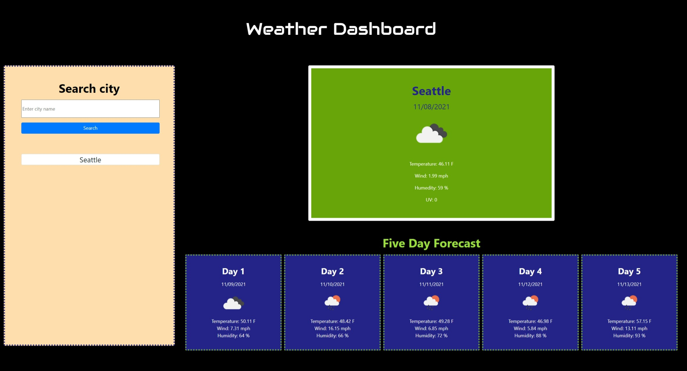

# Weather Dashboard

## Table of contents
1. [Description](#description)
2. [Installation](#installation)
3. [Usage](#usage)
4. [Credits](#credits)
5. [Questions](#questions)

<h2 id="description"> Project Description </h2>
A data dashboard is an information management tool used to track, analyze, and display key performance indicators, metrics, and data points.
Weather Dashboard shows today's weather and a 5 day forecast. The application also displays an icon representation of the actual weather.

## Installation 
This javascript application requires the use of API's to retrieve weather data from cities, as well as local storage to retrieve any persistent data. I also used bootstrap and css to style.
The API's sites used to develop this application are:
* Open weather map.
* Nominatim open street map.

## Usage 
The weather dashboard application displays weather details depending on the users requests. In this case, there is a input form on the left side that is designeted for the user to type the city name of the weather they want to get information about. 
When the user clicks the search button, then the application will display the current weather conditions for that city, as well as city name, date, an icon representing the weather conditions, the temperature, the humidity, the wind speed and the UV index. The user will also be able to see the date, an icon that represents the weather conditions, values for temperature, wind speed and humidity for the next five days of the selected city.

## Credits 
Evelyn G Maldonado.

## Questions 
If you have any questions, please contact me at the information listed below.

* Email: evelyn.gmaldonado@gmail.com
* GitHub: [EvelynGMaldonado](https://github.com/EvelynGMaldonado)

## Extra

* The following images show the web application's appearance and functionality:

* Link to the GitHub Repository:
[Weather Dashboard](https://github.com/EvelynGMaldonado/weather_dashboard)

* Url to the deployed app:
[Weather Dashboard](https://evelyngmaldonado.github.io/weather_dashboard/)